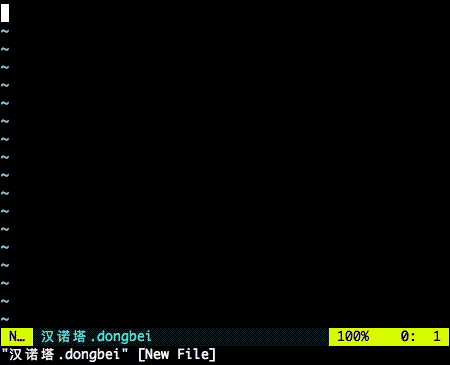

# dongbei-vim

[东北话编程](https://github.com/zhanyong-wan/dongbei) vim/neovim 插件。


效果图环境 vim 8.0 (macOS+iterm2)，colorscheme desert，及辅助插件：

- [airline](https://github.com/vim-airline/vim-airline) 提供 statusline
- [neosnippet](https://github.com/Shougo/neosnippet.vim) 利用本插件提供补全
- [matchup](https://github.com/andymass/vim-matchup) 利用本插件提供匹配跳转与高亮

# 食用方法
- [vim-plug](https://github.com/junegunn/vim-plug) 用户：
``` vim
" add the following line into your vimrc in the vim-plug part:
Plug 'suxpert/dongbei.vim'
```
完事儿了再 `:PlugInstall` 就行咧。

- [Vundle](https://github.com/gmarik/Vundle.vim) 用户：
``` vim
" add the following line into your vimrc in the vundle part:
Plugin 'suxpert/dongbei.vim'
```
完事儿了再 `:PluginInstall` 就行咧。

- DIY 玩家：你都 DIY 了肯定门儿清，那几个文件扔到 `$VIMRUNTIME` 
或者 `~/.vim/` 对应的文件夹就得了。

